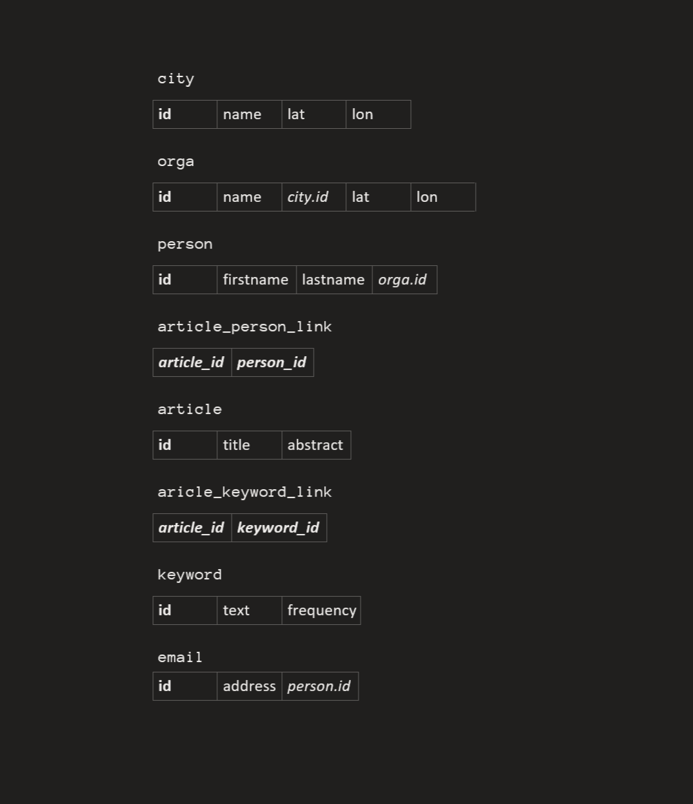

# DHD Data Parser

## Architecture

The Parser's code strictly follows the procedural programming paradigma. I decided to do it this way, because i expected very little event driven communication between the different parts of the code. I was also interested in how the code would develop without the help of instance or even class variables. Did i regret it? A little. Was it difficult? Somewhat. Would i do it again? Probably not.
I focused on having a little amount of global variables and using constants carefully.

## Modules

### Parser Suite
- `parser_main`: controller: can be started with parameter "-r" to force parsing, and/or "-d" to (re)create the sql_database
- `parser_listperson`: parses dhd's listperson.xml into a person dictionary
- `parser_listorg`: parses dhd's listorg.xml into a orga dictionary and location dictionary
- `dhd2019_missing_entities_controller`: sadly listperson.xml and listorg.xml have zero entitlement on being complete and correct: the controller provides methods for outputting a json file where missing data can be manually added and than read back. For locations city names where manually added and are resolved to coordinates with the help of the novatim-api
- `dhd2019_missing_entities.json`: file containing missing data for dictOrga and dictLocation that can be read by dhd2019_missing_entities_controller
- `parser_tei`: parses information from tei files into dictPerson, dictArticle and dictKeyword. Please be aware, that the file redirects a bunch of wrong authorIDs while  parsing
- `parser_keyword_similarity`: finds words according to their morphological similarity. This is a failed concept. It does not work in the context of this application and could be replaced by a stemmer
- `parser_sql_db_creator`: creates a level 3 normalized sql database from the parser dictionaries

### Flexible Scripts
- `constants`: the good 'ol constants file
- `sys_io_json`: provides methods to write/read any python datastructure to/form json files, paths need to be specified in the "source" dictonary
- `novatim_adapter`: provides a one-function-call-easy-to-use interface for the novatim geocoding API
- `spacy_adapter`: provides and easy-to-use interface for Named Identity Recognition with the spaCy library

### Notes
- The parser submodules should always be run in the order above and run through completely. Since this operation takes a significant amount of time, especially since the geocoder needs to be called around 20 times, the dictionaries are stored in a cache folder after parsing (as json files) and retrieved from there if a reload is not issued via the "-r" parameter on start.
- `parser_keyword_similarity` works by first stemming all keywords, then creating "bagOfLetters" one hot encoded vectors for the words, that are then normalized. From these vectors a similarity matrix for all keywords is created. Similarity is determined by the cosine. This step is necessary to be able to commute a difference between words of different length. Because word order was lost in this process, the Levenshtein distance is used to determine if words are truely similar.
This 3 step algorithm was created by @cetceeve using different ideas found in many nlp tutorials. The sensitivity can be ajusted by setting the threshold on the cosine similarity and levenshtein distance required for two tokens to be "connected".
This algorithm was essentially a waste of time, because the morphology of a words holds zero information about its meaning. E.g. "Visualisierung" and "Virtualisierung" are very similar words, but totally different ideas.

## Datastructure

### Parser Internal

The parser outputs a directional tree with dictArticle as a root. Every node is a dictionary. All nodes are connected by explicit IDs so that the dictionaries/nodes can be stored independent from one another in json format.

### SQL Tables

